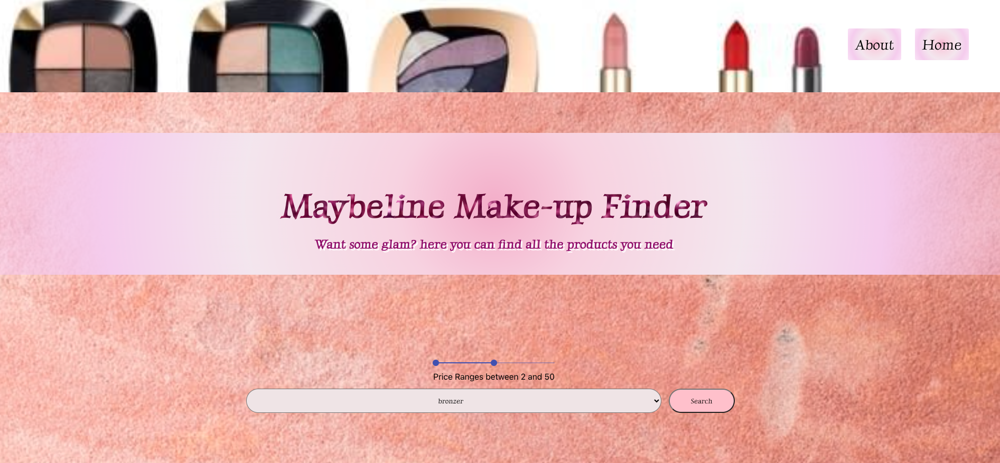

# Maybeline Make-up Finder

## About The Site
Maybeline make-up finder is a site where you can find the products you need with their prices. you can filter the price range you want. 
so if you are looking looking for a less than $9 bronze, just select bronze and flter a less than $9 price. and we'll display all the products that will probably be available in the market

## API used in this site
 
 [Make-up API](http://makeup-api.herokuapp.com/)

## Technologies Used

- React
- CSS
- Javascript
- Netlify

## Site Screen-shots

## Wire Frames

## Installation 
1 - Fork and clone down the repository to your machine.

2 - cd into the repo

3 - Open in VScode by running code . in your terminal

4 - Run npm i or npm install in your terminal

5- Run npm start in your terminal

## User Stories

### MVP Goals
- As a user, I want to see a home page loaded with a specific background related to the theme and kind of app
- As a user, I want to be able to click on the about have a poop up with the information about the site
- As a user, I want to be able to see the searchBar and click on it
-  As a user, I want to be able to search my product by its type and price range
- As a user, I want to have a drop-down that helps me determine what products are available and facilitate my search
### Stretch Goals
- As a user, I want to be able to add the products I want to a cart
-  As a user, I want to be able to save the product i want somewhere so i can access them when i want

## References used 

- [Unsplash](https://unsplash.com/)
- [MDN](https://developer.mozilla.org/en-US/)
- [Geeks for Seeks](https://www.geeksforgeeks.org/how-to-create-price-range-selector-in-reactjs/)
- [React Router](https://reactrouter.com/docs/en/v6/api)
- [Stack Overflow](https://stackoverflow.com/)